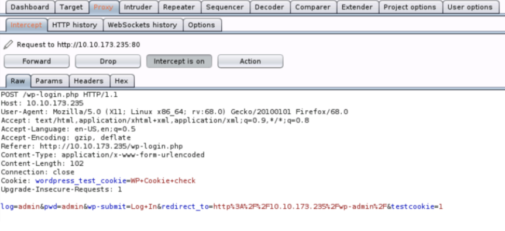
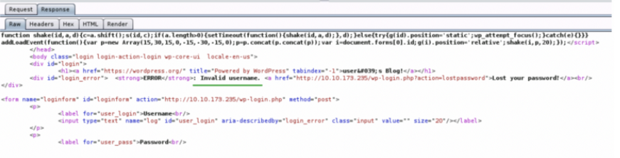

# Flag 1
#### Run Nmap scan
~~~
nmap -sC -sV -O <ip-address> -oN basic_scan.nmap
~~~
- Port 80 is open.
- Navigate to webpage using http://<ip-address>

#### Run gobuster
To enumerate folders run gobuster
~~~
gobuster dir -u http://<ip-address> -w /usr/share/wordlists/dirb/common.txt -o directories.txt
~~~
Robots.txt is a file which prevents web crawlers (spiders) mapping web-sites in the Internet from seeing the contents of the specified files / directories. In this particular case, every bot whether it’s Google or Facebook are restricted from mapping **fsocity.dic** and **key-1-of-3.txt**.

Navigate to http://<ip-address>/robots.txt

cat **key-1-of-3.txt** to get flag 1.

# Flag 2
- From previous step we have a dictionary and on checking it length **wc -l fsocity.dic** it appears to be list of **username** and **passwords**.
- From Gobuster output we know that there is a wordpress site on the server. Our next move is to login to WP.
- Navigate to WP login by http://<ip-address>/wp-login.
- At the very beginning of the dictionary there are some words that potentially could’ve been usernames (mrrobot, Robot, Elliot). On trying I found Elliot to be the username. (Elliot is the name of Mr Robot in TV series).
- One of the issues with this version of WordPress is that it provides with the username feedback even if the password is incorrect. Now, we know that the username is Elliot.

Alternatively, if we are unable to guess then we can use Hydra.

First we need to understand how the login page handles authentication requests using BurpSuite

 

 Above is the intercepted HTTP post request. It can be clearly seen that the authentication schema used by the login page is form-based.

 Below is the response of server for false credentials

 

 Using this we can build Hydra command which looks as below:

 ~~~
 hydra -V -L <path to where fsocity.disc is saved> -p random <ip-address> http-post-form <server response intercepted using BurpSuite>
 ~~~

 **-V** will show the combination of each username:password
 
 **-L** is a list of usernames
 
 **-p** specifies the password (in this case, it doesn’t matter what password we will use as our main objective is username)
 

 **http-post-form** is an attack method followed by the web-form

 **The username is Elliot.**

 To find password we can again use Hydra
 ~~~
 hydra -l Elliot -P /usr/share/wordlists/metasploit/unix_passwords.txt -t 6 http
 ~~~
 **-l** to use username Elliot
 **-P** use password list located /usr/share/wordlists/metasploit/unix_passwords.txt
 **-t** use 6 threads
 **http** protocol used to login

 **The password for Elliot is ER28–0652**

 Login into WP site using username and password found

- Navigate to the Appearance tab and choose the Editor option.
- Pick the 404 Template and insert the php-reverse-shell instead of the default php code. (http://pentestmonkey.net/cheat-sheet/shells/reverse-shell-cheat-sheet).
- Update the template, start NetCat, and enter the path to the 404 template in the URL.
- Stabilize shell:
~~~
python -c 'import pty; pty.spawn("/bin/bash")'
export TERM=xterm
~~~

- on listing files, we see flag 2 and MD5 hash.
- cat the MD5 file and create a copy in local system. This will be used by John the Ripper to guess password for user robot
~~~
john — format=raw-md5 password.raw-md5
~~~
**password.raw-md5** is the filename which has MD5 hash.
**The password is 26 characters long containing English alphabet.**

Login as the robot user and retrieve **flag#2**.

# Flag 3
To get flag3 we need to escalate our privilege. 
We can find files with SUID set as follows
~~~
find directory -perm /permissions
~~~
We can see NMAP has SUID set and its version is 3.81. This version generates **--interactive** session which gives elevated access.
~~~
nmap --interactive
!sh
~~~
cd into root directory and cat **flag 3**